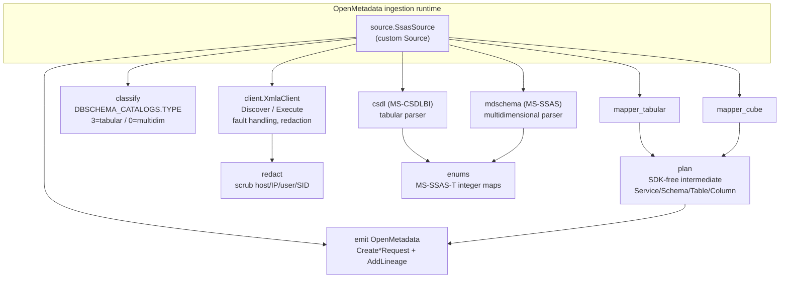
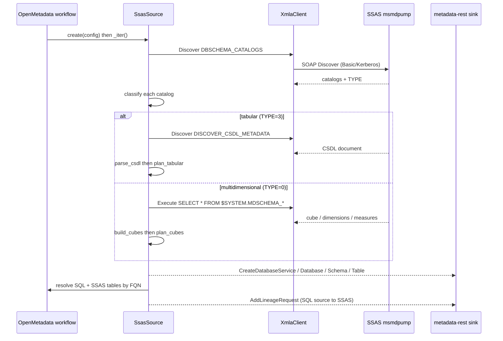
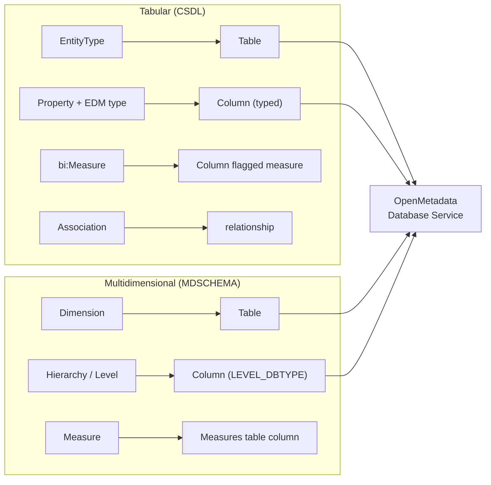
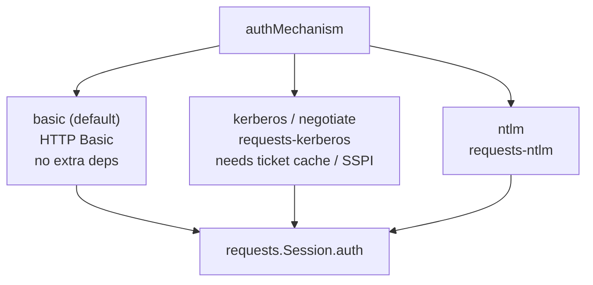
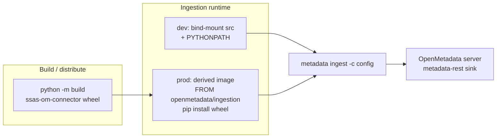
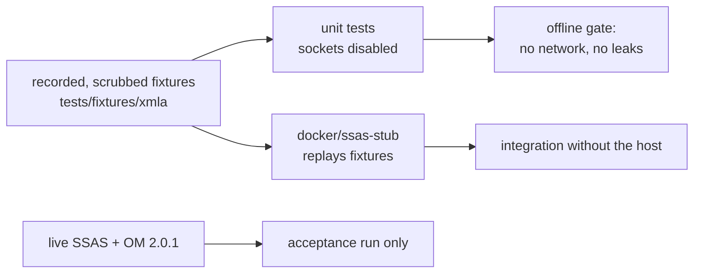

# Architecture

The connector is a thin, read-only bridge from **SQL Server Analysis Services** (XMLA over
HTTP) into **OpenMetadata**. It follows one rule above all: model the connector on *observed*
XMLA behaviour and the Microsoft Open Specifications, never on assumptions
([`docs/references.md`](docs/references.md)).

## Components

Every module except `source` is free of the OpenMetadata SDK, so the client, parsers,
mappers, enum maps and redaction are unit-tested offline. `source` is the only SDK-facing
piece: it turns a plan into `Create*Request` entities and emits lineage.

## Data flow (one ingestion run)

## Model mapping

A tabular model's native CSDL shape and a multidimensional cube both land as the **same**
OpenMetadata database-service shape, so downstream tooling sees one consistent model.

Why multidimensional is a **database** service, not a Dashboard DataModel: OpenMetadata's
`DashboardDataModel` requires a vendor-specific `dataModelType` (PowerBI, Looker, Tableau…),
none of which represents an SSAS cube — labelling it as one would be misleading. Modelling the
cube as a database service (dimensions + measures → tables) reuses the verified tabular path
and keeps the catalog honest. See the addendum in
[`docs/discovery-report.md`](docs/discovery-report.md).

## Least privilege — why CSDL and MDSCHEMA, not TMSCHEMA

Discovery against a real instance found that **TMSCHEMA** (the tabular-native DMVs) requires
an *administrator*; a read-only account faults on every TMSCHEMA rowset. **CSDL** and
**MDSCHEMA** answer for a plain reader and, together, describe both model kinds fully. The
connector therefore holds only reader credentials and never issues an admin-gated request —
a `test_connection` probe uses `DISCOVER_DATASOURCES` and fails loudly on a 401/fault.

## Authentication

The SSAS endpoint is IIS `msmdpump`, which can front several IIS auth schemes. The client
selects one per `authMechanism`:

Kerberos/NTLM ship as optional extras (`[kerberos]`, `[ntlm]`); requesting one without the
extra installed raises a clear install message.

**`kerberos` and `negotiate` need no `user`/`password`.** They authenticate from the ambient
ticket cache, and `_requests_auth` ignores both. The Source therefore does not demand them for
those mechanisms — requiring them forced a dummy credential into the service config, where it
sat in clear text *and* was not the credential in use. `basic` and `ntlm` still require both,
and say which keys are missing rather than raising a bare `KeyError`.

One consequence worth stating, because it is easy to reintroduce: the runtime scrubber's
machine-name redaction must not be keyed on `user`. It once ran only through the `DOMAIN\user`
pattern, so making `user` optional silently disabled NetBIOS redaction for exactly the
deployment the change enabled. There is now a standalone pattern that does not depend on a
user being configured. Basic over plain HTTP is credentials-in-clear,
so it is meant only behind a network firewall or with HTTPS in front; the connector never
logs request bodies or the `Authorization` header. The MSSQL lineage source is a separate,
built-in OpenMetadata connector (via `pymssql`) with its own auth.

## Deployment

Only OpenMetadata, its datastore, its search backend and the connector run locally; SQL
Server and SSAS are remote and never appear in any compose file.

## Testing strategy

- **Unit** — every parser/mapper/client path against fixtures, with `pytest-socket` blocking
  all sockets. Tests touching `source.py` need the OpenMetadata SDK and are `importorskip`-gated,
  so they skip locally and run in the `test-sdk` CI job inside the ingestion image; a test that
  only ever skips proves nothing, so those are verified there rather than assumed.
- **Leak gate** — `tests/hooks/test_leak_gate.sh` pins the commit gate's boundary in both
  directions: a container image tag must pass, a file path carrying a real address must not.
  Its fixtures are assembled at runtime, because written literally they are exactly what the
  gate blocks. CI runs the gate over every tracked file, not only staged ones, so a bypassed
  hook or a rebase cannot slip a token through.
- **Integration** — the stub server replays fixtures so the pipeline can run with no host.
- **Acceptance** — a real ingestion into a live OpenMetadata 2.0.1, used to prove the
  end-to-end result; never a prerequisite for the unit suite (the operator IP is allowlisted
  and changes).

## Guarantees

- No credential, host, IP, machine name, SID or connection string in any committed file,
  fixture, log line or commit message (pre-commit leak-gate).
- Reader-only access; no TMSCHEMA/admin rowset.
- Deterministic, offline unit tests.
- Dependency updates are Renovate's, and `openmetadata-ingestion` is dashboard-approval only:
  both series exist on PyPI, so a bump does not error — pip silently changes the SDK inside the
  ingestion image and breaks every other connector alongside this one. A real change must move
  `docker/compose.yml`, `scripts/run-ingestion.sh` and the constitution pin together.
