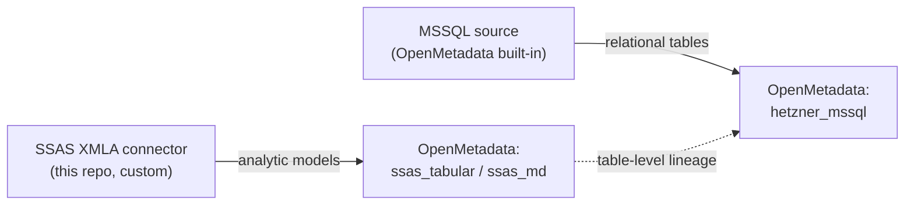
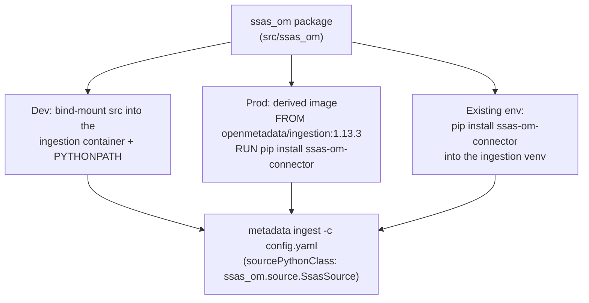
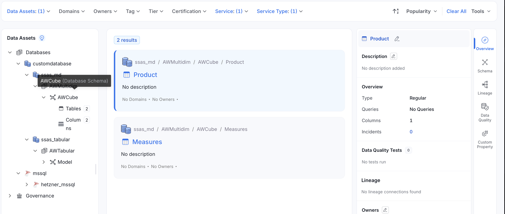
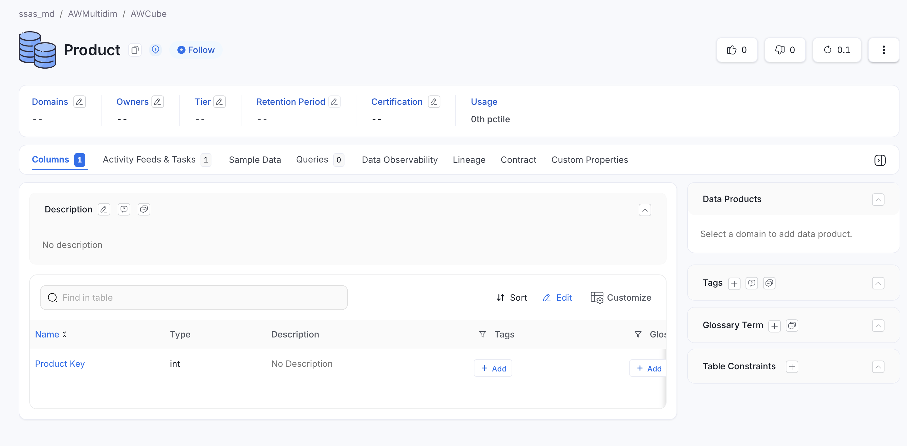
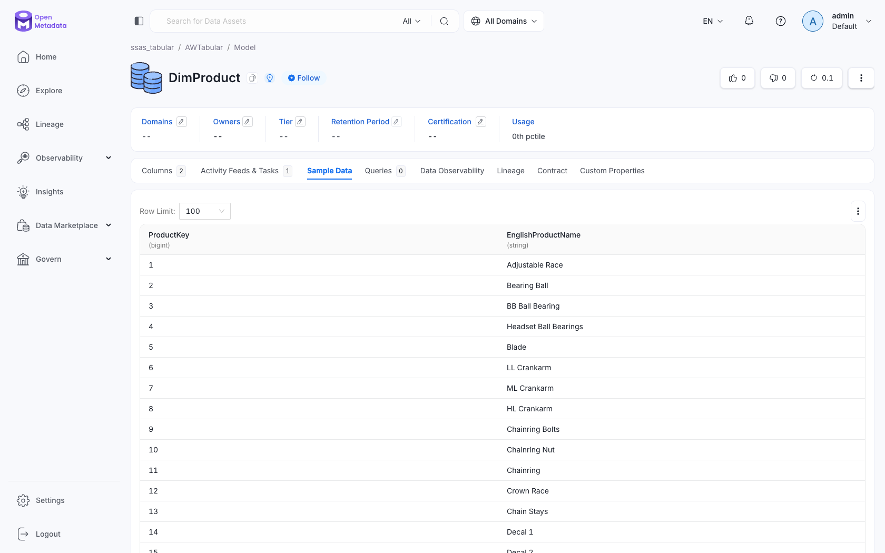

# SSAS → OpenMetadata connector

[](https://github.com/oluies/ssas-openmetadata-connector/actions/workflows/ci.yml)
[](https://github.com/oluies/ssas-openmetadata-connector/actions/workflows/secret-scan.yml)


[](https://github.com/astral-sh/ruff)
[](https://github.com/astral-sh/uv)

[](LICENSE)

## Credits

- **Örjan Lundberg** — creator and lead committer.
  [LinkedIn](https://www.linkedin.com/in/orjanlundberg/)
- **Mattias Lind** — SQL Server expert; advised on the SSAS / SQL Server side.
  [mattiaslind.info](https://mattiaslind.info)
- **[Hetzner](https://www.hetzner.com/)** — cloud infrastructure hosting the SSAS
  test fixture (SQL Server + tabular & multidimensional Analysis Services).

A read-only [OpenMetadata](https://open-metadata.org) ingestion connector for **SQL
Server Analysis Services**, over XMLA/HTTP (`msmdpump`). It ingests both model kinds as
database services and links them to their relational source for lineage:

- **Tabular** models via `DISCOVER_CSDL_METADATA` ([MS-CSDLBI]) — the model's native shape.
- **Multidimensional** cubes via `MDSCHEMA_*` ([MS-SSAS]) — modelled as a database service
  (dimensions + measures → tables).
- **Lineage** — each SSAS table is linked to its SQL source table (ingested by the built-in
  MSSQL connector).

It authenticates as a **least-privilege reader** and never issues an admin-gated (TMSCHEMA)
request. Built against the Microsoft Open Specifications, not blog posts — see
[`docs/references.md`](docs/references.md).


## The two connectors

This project involves **two** OpenMetadata connectors that together give you the SSAS
metadata *and* its lineage back to the relational source. They are easy to confuse, so:

### 1. SSAS XMLA connector — the custom one (this repo)

`ssas_om.source.SsasSource`. It connects to **SQL Server Analysis Services** over
**XMLA / HTTP** — the IIS `msmdpump.dll` endpoint — and ingests the *analytic* layer:
tabular models (via CSDL) and multidimensional cubes (via MDSCHEMA), each as an
OpenMetadata **database service** with tables and typed columns. This is the code you are
looking at. Its auth is HTTP-based: `basic` (default), or `kerberos` / `negotiate` / `ntlm`
via the `requests-*` extras (`authMechanism`).

### 2. MSSQL lineage source — OpenMetadata's built-in one

OpenMetadata's own **SQL Server** connector. We do **not** write it — we only supply a
config (`config/ingestion-mssql.yaml.tmpl`). It ingests the *relational* database the SSAS
models are built from (e.g. `AdventureWorksDW2022`) — its tables, columns and views — as a
separate database service. Its auth uses a SQLAlchemy driver: `mssql+pymssql` (SQL auth,
the default here), `mssql+pytds` (Windows/Kerberos, bundled — no extra), or `mssql+pyodbc`
(ODBC `Trusted_Connection` / Azure AD).

### Why both, and how they connect

An SSAS model is derived from relational tables. The SSAS connector catalogs the analytic
layer; the MSSQL source catalogs the relational layer; then the SSAS connector emits
**table-level lineage** linking each SSAS table to its matching SQL source table (by name).



Run either connector alone if you only want that layer; **lineage needs both** (ingest the
MSSQL source first so the SSAS connector can resolve the target tables).

## How it is installed and distributed

The connector is an ordinary Python package (`ssas-om-connector`, package `ssas_om`) whose
`ssas_om.source.SsasSource` implements the OpenMetadata **custom source** contract. It runs
**inside the OpenMetadata ingestion runtime** and is referenced from the ingestion config by
its class path — OpenMetadata imports and drives it.

Three distribution modes, from dev to prod:



- **Dev (this repo):** `scripts/run-ingestion.sh` bind-mounts `src/` into
  `openmetadata/ingestion:1.13.3` with `PYTHONPATH=/opt/connector` and runs
  `metadata ingest`. Zero build step.
- **Prod:** build a thin image `FROM docker.getcollate.io/openmetadata/ingestion:1.13.3`
  that `pip install`s the wheel, and point your OpenMetadata ingestion pipeline at it.
- **Existing ingestion venv:** `pip install ssas-om-connector` (+ optional extras) alongside
  the OpenMetadata SDK.

The package builds a normal wheel: `python -m build` (hatchling). Optional extras:
`[kerberos]`, `[ntlm]`, `[mssql]`.

## Quickstart (local)

```bash
cp .env.example .env          # fill in host / user / password
docker compose -f docker/compose.yml up -d openmetadata-server   # OM 1.13.3 + deps

# an ingestion-bot / admin JWT for the metadata-rest sink:
export OM_JWT_TOKEN=...        # e.g. admin login token from your OM instance

./scripts/run-ingestion.sh config/ingestion-tabular.yaml.tmpl   # tabular + lineage
./scripts/run-ingestion.sh config/ingestion-md.yaml.tmpl        # multidimensional
# the built-in MSSQL source (lineage target):
./scripts/run-ingestion.sh config/ingestion-mssql.yaml.tmpl
```

The result in OpenMetadata: database services `ssas_tabular`, `ssas_md`, and `hetzner_mssql`,
with the SSAS tables linked to their SQL source.

## What it looks like in OpenMetadata

After ingestion, the analytic models and their relational source sit side by side in the
catalog — `ssas_md` (multidimensional cube `AWCube`), `ssas_tabular` (tabular `AWTabular` /
`Model`), and the built-in `hetzner_mssql` source:



Each cube dimension and the tabular tables land as tables with typed columns — e.g. the
`Product` table under `ssas_md / AWMultidim / AWCube`:



## Sample data & profiling

Beyond structure, the connector attaches a few **example rows** to each tabular table so
the OpenMetadata *Sample Data* tab is populated. It reads them the same read-only way it
reads metadata — a DAX `EVALUATE TOPN(n, 'Table')` against the model — and posts them via
the sample-data API. It is **on by default** and fully optional:

```yaml
connectionOptions:
  includeSampleData: "false"   # turn it off entirely
  sampleDataRowCount: "20"     # or just cap how many rows are sampled (default 50)
```

Only **tabular** tables are sampled (a multidimensional MDX sampler is a follow-up), the
`RowNumber` system column is dropped, and a failed sample query never fails the run — it is
logged and skipped. Sampling reads live data, so leave it off for sensitive models.



> Status: validated end-to-end against the live SSAS instance — `EVALUATE TOPN(50, ...)`
> sample rows for the tabular tables land in each table's **Sample Data** tab.

For the **relational** source, row sampling and column statistics come from OpenMetadata's
own **profiler** workflow (a separate `type: Profiler` run over the `hetzner_mssql` service),
toggled with `generateSampleData` — see `config/ingestion-mssql.yaml.tmpl`.

## Configuration

Credentials come only from a gitignored `.env` (never committed). The ingestion templates
under `config/` are committed with `${VAR}` placeholders; `run-ingestion.sh` substitutes them
into a `0600`, auto-deleted runtime file.

`connectionOptions` understood by the connector:

| option | required | meaning |
|---|---|---|
| `host` | yes | e.g. `http://ssas-host` |
| `endpoint` | yes | `/olap-tab/msmdpump.dll` or `/olap-md/msmdpump.dll` |
| `user`, `password` | yes | reader credentials |
| `catalog` | no | restrict to one catalog; otherwise all are discovered |
| `authMechanism` | no | `basic` (default), `kerberos`, `negotiate`, `ntlm` |
| `includeSampleData` | no | sample a few rows per tabular table (default `true`; set `false` to disable) |
| `sampleDataRowCount` | no | max rows to sample per table (default `50`) |
| `lineageService` / `lineageDatabase` / `lineageSchema` | no | link tables to a SQL source (schema default `dbo`) |

### Security models

`basic` (HTTP Basic) is built in and needs no extra dependency. **Kerberos / Negotiate /
NTLM** are supported through `authMechanism`, but they are *not* just a setting — the
ingestion runtime must be prepared for them. The connector runs inside the Linux
OpenMetadata ingestion image, so it authenticates with a **Kerberos keytab/ticket**, not the
logged-in Windows identity (true Windows SSPI works only if the connector runs on Windows).

**Using Kerberos (Windows integrated auth) against `msmdpump`:**

1. **SSAS side** — configure the `/olap-tab` (and `/olap-md`) IIS applications for **Windows
   Authentication** (Negotiate/Kerberos) instead of Basic, and register an SPN for the host,
   e.g. `setspn -S HTTP/ssas-host.domain.com DOMAIN\svc_account`.
2. **Install the extra in the runtime.** In your derived ingestion image:
   ```dockerfile
   FROM docker.getcollate.io/openmetadata/ingestion:1.13.3
   RUN pip install 'ssas-om-connector[kerberos]'   # requests-kerberos + gssapi
   ```
3. **Provide Kerberos config and credentials** to that container: mount `/etc/krb5.conf` for
   your realm plus a **keytab**, and obtain a ticket before the run
   (`kinit -kt /etc/krb5.keytab svc_account@DOMAIN.COM`), or run under a valid `KRB5CCNAME`
   ticket cache. For NTLM instead: `pip install 'ssas-om-connector[ntlm]'` and pass the
   Windows `user`/`password` in `DOMAIN\user` form.
4. **Set the option** in the ingestion config:
   ```yaml
   connectionOptions:
     authMechanism: kerberos      # or: negotiate | ntlm | basic
     host: "https://ssas-host.domain.com"   # HTTPS for integrated auth
     endpoint: "/olap-tab/msmdpump.dll"
     user: "svc_account"          # used by ntlm; ignored by kerberos ticket auth
     password: "..."
   ```

Requesting `kerberos`/`ntlm` without the matching extra installed raises a clear error naming
the missing extra. The connector never logs request bodies or the `Authorization` header.
Basic over plain HTTP sends credentials in clear text — use it only behind a network
firewall, or put HTTPS in front. The **MSSQL lineage source** is a separate, built-in OpenMetadata connector with its own
auth — and unlike the XMLA path it needs no extra: OpenMetadata's SQL Server adapter
ships **python-tds (`pytds`)** in the ingestion image, which has native Kerberos /
Negotiate / NTLM / SSPI. Use `scheme: mssql+pytds` (with a krb5.conf + ticket) for
Windows integrated auth to the SQL engine; `mssql+pymssql` (the default here) is plain
SQL auth, `mssql+pyodbc` supports ODBC `Trusted_Connection`/Azure AD.

> Status: the `basic` path is validated end-to-end against a live instance. The
> `kerberos`/`negotiate`/`ntlm` selection logic is unit-tested, but end-to-end validation
> needs a Windows-authenticated SSAS endpoint (the reference fixture uses Basic).

See [`ARCHITECTURE.md`](ARCHITECTURE.md#authentication) for the diagram.

## Testing

Unit tests are **offline and hermetic** — sockets are disabled and every response comes from
recorded, scrubbed fixtures under `tests/fixtures/xmla/`. They never touch the live host.

```bash
uv run --no-project --with pytest --with pytest-socket --with lxml --with requests \
  pytest tests/unit            # SDK-free modules run; source tests skip without the OM SDK
```

Lint and type-check with the Astral stack (managed by [uv](https://docs.astral.sh/uv/)):

```bash
uvx ruff check .               # linter
uvx ty check                   # type checker (SDK-free core; source.py is the SDK boundary)
```

Full coverage (including the `SsasSource` tests) runs where the OpenMetadata SDK is present —
e.g. inside the ingestion image. CI runs all three: `ruff` + `ty`, the hermetic suite on
Python 3.10-3.12, and the full suite inside `openmetadata/ingestion:1.13.3`. No fixture, log, or commit ever contains a host, IP,
username, machine name, SID or connection string (enforced by a pre-commit leak-gate).

## Repository layout

```
src/ssas_om/        connector: client, parsers (csdl, mdschema), mappers, source, redaction
config/             committed ingestion templates (no secrets)
docker/             OpenMetadata 1.13.3 compose + a fixture stub server
scripts/            probe.py (discovery) and run-ingestion.sh
tests/              offline unit tests + recorded fixtures
specs/, docs/       spec-kit artefacts, discovery report, normative references
```

## License

Apache License 2.0 — see [`LICENSE`](LICENSE).

This connector **depends on** the OpenMetadata SDK (`openmetadata-ingestion`), which
Collate, Inc. distributes under the **Collate Community License Agreement v1.0** (a
source-available license that, among other things, forbids use for a competing
software/platform/infrastructure-as-a-service). This project does not bundle or
redistribute that SDK — it is installed separately — but running the connector means
running the SDK, so your use must comply with those terms. See [`NOTICE`](NOTICE).

See [`ARCHITECTURE.md`](ARCHITECTURE.md) for the design and data flow.
