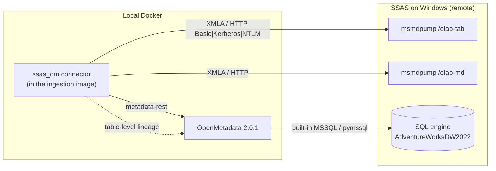
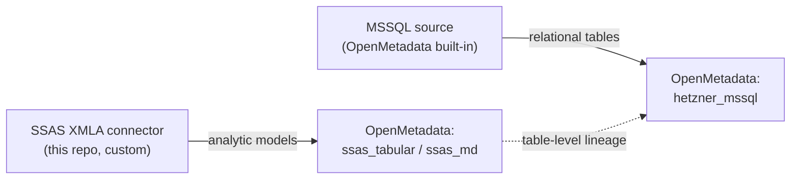
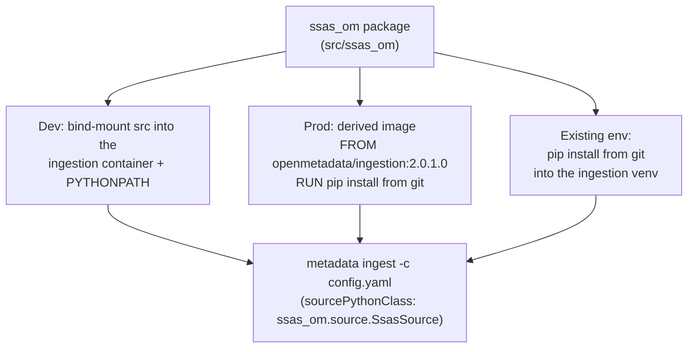

# SSAS → OpenMetadata connector

[](https://github.com/oluies/ssas-openmetadata-connector/actions/workflows/ci.yml)
[](https://github.com/oluies/ssas-openmetadata-connector/actions/workflows/secret-scan.yml)


[](https://github.com/astral-sh/ruff)
[](https://github.com/astral-sh/uv)

[](LICENSE)

## Credits

- **Örjan Lundberg** — creator and lead committer.
  [LinkedIn](https://www.linkedin.com/in/orjanlundberg/)
- **Mattias Lind** — SQL Server expert; advised on the SSAS / SQL Server side.
  [mattiaslind.info](https://mattiaslind.info)
- **[Hetzner](https://www.hetzner.com/)** — cloud infrastructure hosting the SSAS
  test fixture (SQL Server + tabular & multidimensional Analysis Services).

A read-only [OpenMetadata](https://open-metadata.org) ingestion connector for **SQL
Server Analysis Services**, over XMLA/HTTP (`msmdpump`). It ingests both model kinds as
database services and links them to their relational source for lineage:

- **Tabular** models via `DISCOVER_CSDL_METADATA` ([MS-CSDLBI]) — the model's native shape.
- **Multidimensional** cubes via `MDSCHEMA_*` ([MS-SSAS]) — modelled as a database service
  (dimensions + measures → tables).
- **Lineage** — each SSAS table is linked to its SQL source table (ingested by the built-in
  MSSQL connector).

It authenticates as a **least-privilege reader** and never issues an admin-gated (TMSCHEMA)
request. Built against the Microsoft Open Specifications, not blog posts — see
[`docs/references.md`](docs/references.md).



## The two connectors

This project involves **two** OpenMetadata connectors that together give you the SSAS
metadata *and* its lineage back to the relational source. They are easy to confuse, so:

### 1. SSAS XMLA connector — the custom one (this repo)

`ssas_om.source.SsasSource`. It connects to **SQL Server Analysis Services** over
**XMLA / HTTP** — the IIS `msmdpump.dll` endpoint — and ingests the *analytic* layer:
tabular models (via CSDL) and multidimensional cubes (via MDSCHEMA), each as an
OpenMetadata **database service** with tables and typed columns. This is the code you are
looking at. Its auth is HTTP-based: `basic` (default), or `kerberos` / `negotiate` / `ntlm`
via the `requests-*` extras (`authMechanism`).

### 2. MSSQL lineage source — OpenMetadata's built-in one

OpenMetadata's own **SQL Server** connector. We do **not** write it — we only supply a
config (`config/ingestion-mssql.yaml.tmpl`). It ingests the *relational* database the SSAS
models are built from (e.g. `AdventureWorksDW2022`) — its tables, columns and views — as a
separate database service. Its auth uses a SQLAlchemy driver: `mssql+pymssql` (SQL auth,
the default here), `mssql+pytds` (Windows/Kerberos, bundled — no extra), or `mssql+pyodbc`
(ODBC `Trusted_Connection` / Azure AD).

### Why both, and how they connect

An SSAS model is derived from relational tables. The SSAS connector catalogs the analytic
layer; the MSSQL source catalogs the relational layer; then the SSAS connector emits
**table-level lineage** linking each SSAS table to its matching SQL source table (by name).



Run either connector alone if you only want that layer; **lineage needs both** (ingest the
MSSQL source first so the SSAS connector can resolve the target tables).

## How it is installed and distributed

The connector is an ordinary Python package (`ssas-om-connector`, package `ssas_om`) whose
`ssas_om.source.SsasSource` implements the OpenMetadata **custom source** contract. It runs
**inside the OpenMetadata ingestion runtime** and is referenced from the ingestion config by
its class path — OpenMetadata imports and drives it.

Three distribution modes, from dev to prod:



- **Dev (this repo):** `scripts/run-ingestion.sh` bind-mounts `src/` into
  `openmetadata/ingestion:2.0.1.0` with `PYTHONPATH=/opt/connector` and runs
  `metadata ingest`. Zero build step.
- **Prod:** build a thin image `FROM docker.getcollate.io/openmetadata/ingestion:2.0.1.0`
  that installs the connector, and point your OpenMetadata ingestion pipeline at it.
- **Existing ingestion venv:** install alongside the OpenMetadata SDK.

> **This package is not published on PyPI.** `pip install ssas-om-connector`
> will not resolve. Install from git:
>
> ```bash
> pip install "ssas-om-connector[mssql] @ git+https://github.com/oluies/ssas-openmetadata-connector@main"
> ```
>
> Pin to a tag rather than `main` for anything reproducible.

The package builds a normal wheel: `python -m build` (hatchling). Optional extras:
`[kerberos]`, `[ntlm]`, `[mssql]`.

## Quickstart (local)

```bash
cp .env.example .env          # fill in host / user / password
docker compose -f docker/compose.yml up -d openmetadata-server   # OM 2.0.1 + deps

# an ingestion-bot / admin JWT for the metadata-rest sink:
export OM_JWT_TOKEN=...        # e.g. admin login token from your OM instance

./scripts/run-ingestion.sh config/ingestion-tabular.yaml.tmpl   # tabular + lineage
./scripts/run-ingestion.sh config/ingestion-md.yaml.tmpl        # multidimensional
# the built-in MSSQL source (lineage target):
./scripts/run-ingestion.sh config/ingestion-mssql.yaml.tmpl
```

> **Upgrading an existing stack?** This is a clean-start recipe. `mysql` bind-mounts
> `./docker-volume/db-data`, so if that directory was written by a 1.13.3 stack,
> `execute-migrate-all` will run 2.0.1 schema migrations over it and the `db` image bump
> may carry a MySQL server upgrade across the same datadir. Back it up first, or
> `rm -rf docker-volume/db-data` for a genuinely clean start. The 2.0.1 stack has not been
> exercised against a 1.13.3 datadir here.

The result in OpenMetadata: database services `ssas_tabular`, `ssas_md`, and `hetzner_mssql`,
with the SSAS tables linked to their SQL source.

## What it looks like in OpenMetadata

After ingestion, the analytic models and their relational source sit side by side in the
catalog — `ssas_md` (multidimensional cube `AWCube`), `ssas_tabular` (tabular `AWTabular` /
`Model`), and the built-in `hetzner_mssql` source:


Each cube dimension and the tabular tables land as tables with typed columns — e.g. the
`Product` table under `ssas_md / AWMultidim / AWCube`:


## Sample data & profiling

Beyond structure, the connector attaches a few **example rows** to each tabular table so
the OpenMetadata *Sample Data* tab is populated. It reads them the same read-only way it
reads metadata — a DAX `EVALUATE TOPN(n, 'Table')` against the model — and posts them via
the sample-data API. It is **on by default** and fully optional:

```yaml
connectionOptions:
  includeSampleData: "false"   # turn it off entirely
  sampleDataRowCount: "20"     # or just cap how many rows are sampled (default 50)
```

Only **tabular** tables are sampled (a multidimensional MDX sampler is a follow-up), the
`RowNumber` system column is dropped, and a failed sample query never fails the run — it is
logged and skipped. Sampling reads live data, so leave it off for sensitive models.


> Status: validated end-to-end against the live SSAS instance — `EVALUATE TOPN(50, ...)`
> sample rows for the tabular tables land in each table's **Sample Data** tab.

For the **relational** source, row sampling and column statistics come from OpenMetadata's
own **profiler** workflow (a separate `type: Profiler` run over the `hetzner_mssql` service),
toggled with `generateSampleData` — see `config/ingestion-mssql.yaml.tmpl`.

## Configuration

Credentials come only from a gitignored `.env` (never committed). The ingestion templates
under `config/` are committed with `${VAR}` placeholders; `run-ingestion.sh` substitutes them
into a `0600`, auto-deleted runtime file.

## Configuration reference

Every value in `connectionOptions` is a **string** — the OpenMetadata schema types it as
`dict[str, str]`, and the UI form has no other input type. Booleans and numbers are therefore
quoted (`"true"`, `"50"`) and parsed permissively by the connector: `_as_bool` accepts
`1/true/yes/on` in any case, and `_as_int` falls back to the default on anything unparseable.

### Connection

| option | type | required | default | meaning |
|---|---|---|---|---|
| `host` | string | **yes** | — | `http://ssas-host` for `transport: http`. For `transport: tcp` a bare hostname is enough; any scheme, port or path is stripped, so the same value works for both. |
| `transport` | `http` \| `tcp` | no | `http` | `http` goes through IIS `msmdpump`; `tcp` speaks the native XMLA/TCP binding and needs no IIS. Anything else is rejected. |
| `endpoint` | string | **for `http`** | — | The `msmdpump` path, e.g. `/olap-tab/msmdpump.dll`. Meaningless on `tcp` and ignored there. |
| `port` | integer | **for `tcp`** | — | The instance's **pinned** TCP port. No default on purpose: guessing between a default instance's well-known port and a named instance's pinned one presents to the operator as a hang, not an error. |

### Authentication

| option | type | required | default | meaning |
|---|---|---|---|---|
| `authMechanism` | `basic` \| `ntlm` \| `kerberos` \| `negotiate` | no | **follows `transport`**: `basic` for `http`, `kerberos` for `tcp` | See [Choosing `authMechanism`](#choosing-authmechanism). `basic` on `tcp` is rejected, not coerced. |
| `user` | string | **for `basic` / `ntlm`** | — | Reader account. Domain accounts take the `DOMAIN\user` form. |
| `password` | string | **for `basic` / `ntlm`** | — | The credential itself. Stored unencrypted — see [How the password is stored](#how-the-password-is-stored). Prefer `passwordEnvVar`. |
| `passwordEnvVar` | string | alternative to `password` | — | The **name** of an environment variable holding the password. The value never enters OpenMetadata. Setting both this and `password` is an error, not a precedence rule. |
| `servicePrincipalClass` | string | no | `MSOLAPSvc.3` | The service class in the SPN requested for Kerberos. Change it only if the instance is registered under another class (SQL Browser uses `MSOLAPDisco.3`). |

`user` and `password` are **not** required for `kerberos` or `negotiate`: those authenticate
from the ambient ticket cache and ignore both. Supplying them anyway is harmless but pointless
— and puts a credential in the config for nothing.

### What gets ingested

| option | type | required | default | meaning |
|---|---|---|---|---|
| `catalog` | string | no | *all* | Restrict ingestion to one catalog. Omit to discover every catalog the account can see. |
| `includeSampleData` | boolean | no | `"true"` | Sample a few rows per tabular table for the UI's sample-data tab. Set `"false"` where reading rows is unwelcome — the connector then issues no `EVALUATE` at all. |
| `sampleDataRowCount` | integer | no | `"50"` | Maximum rows sampled per table. Ignored when `includeSampleData` is false. |

### Lineage to the SQL source

All three are optional; set them to link ingested tables to a SQL Server source ingested
separately by OpenMetadata's built-in connector. **`lineageService` and `lineageDatabase` are
both required for any lineage to be emitted** — with either missing the connector emits none,
silently, because a half-specified target would produce edges pointing nowhere.

| option | type | required | default | meaning |
|---|---|---|---|---|
| `lineageService` | string | for lineage | — | The OpenMetadata **service name** of the SQL source. |
| `lineageDatabase` | string | for lineage | — | Database name within that service. |
| `lineageSchema` | string | no | `dbo` | Schema within that database. |


### How the password is stored

Worth knowing before putting a production credential in `connectionOptions`, because it is not
what a built-in connector does.

`connectionOptions` is typed `RootModel[dict[str, str]]` in the OpenMetadata schema
(`connectionBasicType.ConnectionOptions`). A field the schema marks as a password generates as
`CustomSecretStr`; this one generates as plain `str`. That annotation is what the masking and
the secrets manager key off, so its absence has three consequences:

- **Not masked.** The value is returned by the API and rendered in the UI as an ordinary
  option, to anyone who can view the service.
- **Not externalised.** With the **`db`** secrets-manager provider — the default, and what this
  deployment uses — the ingestion-side implementation is a pass-through: `get_string_value`
  returns what it was handed, fetching nothing from an external store. The value travels
  inline with the service config.
- **Not encrypted at rest by the provider.** OpenMetadata encrypts the fields the schema marks
  as secrets; an unannotated option is not one of them.

Nothing in the ingestion path treats `connectionOptions` as secret-bearing — the only code that
touches it is `ssl_manager.py`, which *writes* certificate paths into it.

**Verify it on your own instance** rather than taking this on trust; it is one request:

```bash
curl -s -H "Authorization: Bearer $OM_JWT_TOKEN" \
  "$OM_HOST/api/v1/services/databaseServices/name/<service>?fields=connection" \
  | jq '.connection.config.connectionOptions'
```

If the password comes back in clear, it is stored in clear.

**What to do about it**, in order of preference:

1. **Use `passwordEnvVar`** and let the runtime supply the value. `connectionOptions` then
   holds only a variable *name*, which is not a credential, and the password lives wherever
   your platform already keeps secrets:

   ```yaml
   connectionOptions:
     user: "DOMAIN\\svc_om_reader"
     passwordEnvVar: "SSAS_PASSWORD"      # the NAME, not the value
   ```

   How the variable reaches the ingestion pod depends on how ingestion is spawned, and the two
   paths differ in an important way:

   | path | mechanism | can it reference a Secret? |
   |---|---|---|
   | `omjob-operator` | `OMJob.spec.mainPodSpec.env[]` | **yes** — the CRD supports `valueFrom.secretKeyRef` |
   | chart passthrough | `pipelineServiceClientConfig.k8s.extraEnvVars` | **no** — schema is `array<string>`, serialised to a Helm-managed Secret, so literals only |

   Either way the credential leaves the OpenMetadata database and stops being readable through
   the service API. The `extraEnvVars` route applies the variable to *every* ingestion pod,
   which is worth weighing — though a pod that can read it already receives every other
   service's credentials from OpenMetadata anyway.

   [Where the password lives, end to end](#where-the-password-lives-end-to-end) traces each
   hop and who can read it; [Where to configure it](#where-to-configure-it) names the file for
   each deployment. Locally the same option works with `run-ingestion.sh`, `docker compose`,
   or a plain `export`.

2. **Use `kerberos`** and no password at all. The ticket comes from the runtime, not the
   config. This is the only option that removes the credential rather than protecting it — see
   [`docs/kerberos-in-kubernetes.md`](docs/kerberos-in-kubernetes.md) for what that takes in
   Kubernetes, including two blockers worth knowing about first.
3. **Give the account nothing worth stealing.** It needs only read on the SSAS databases; the
   connector never issues an admin-gated (TMSCHEMA) request, so a per-database reader role is
   sufficient. Scope it so disclosure is a nuisance, not an incident.
4. **Restrict who can read the service** in OpenMetadata, since viewing it reveals the value.

### Where the password lives, end to end

With `passwordEnvVar`, the credential never enters OpenMetadata. It is worth being able to
point at each hop, because when authentication fails the question is always *which* copy is
stale.

```
  source of truth            delivery                      consumption
  ---------------            --------                      -----------
  Kubernetes Secret   -->  OMJob.spec.mainPodSpec.env[]  -->  $SSAS_PASSWORD
  (or Helm value,          .valueFrom.secretKeyRef            in the ingestion pod
   or local .env)          (or extraEnvVars, literals)         |
                                                               v
                                                   connectionOptions.passwordEnvVar
                                                     names the variable; the
                                                     connector reads os.environ
                                                               |
                                                               v
                                                   OpenMetadata stores only
                                                     the variable NAME
```

| hop | holds | who can read it |
|---|---|---|
| Kubernetes Secret | the password | anyone with `get secret` in that namespace |
| ingestion pod env | the password | anything running in that pod |
| `connectionOptions` | the variable **name** | anyone who may view the service |
| OpenMetadata database | the variable **name** | OpenMetadata operators, DB admins |

Compare with a literal `password`, where the bottom two rows hold the credential itself.

One property to keep in mind: an environment variable is visible to everything in the pod and
to `kubectl exec`. This narrows exposure from "anyone who can view the service in the UI" to
"anyone who can exec into the ingestion namespace" — a smaller and more auditable set, but not
zero. Only `kerberos` removes the credential rather than relocating it.

### Where to configure it

Four places, depending on how you run the connector. In each case
`connectionOptions.passwordEnvVar` names the variable; only the delivery differs.

**Kubernetes, `omjob-operator`** (`useOMJobOperator: true`). Create the Secret alongside the
others, then reference it:

```bash
kubectl -n "$NS" create secret generic ssas-reader \
  --from-literal=SSAS_PASSWORD='...'
```

The `OMJob` the server generates takes the reference through
`mainPodSpec.env[].valueFrom.secretKeyRef`, which the CRD supports
(`charts/<ver>/openmetadata/templates/omjob-crd.yaml`).

**Kubernetes, chart passthrough.** `openmetadata.config.pipelineServiceClientConfig.k8s.extraEnvVars`
in `values-openmetadata.yaml` — the same block that already sets `ingestionImage` and
`useOMJobOperator`. Note the constraint, which comes from the chart's own schema: the field is
`array<string>`, serialised with `toJson | b64enc` into a Helm-managed Secret, so it carries
**literal values only** and applies to **every** ingestion pod.

**Local, `run-ingestion.sh`.** Put `SSAS_PASSWORD=...` in the gitignored `.env`; the script
already exports it and substitutes `${VAR}` placeholders into a `0600` runtime file it deletes
on exit.

**Docker Compose.** Add it to the ingestion service's `environment:` in `docker/compose.yml`,
or an `env_file:` pointing at `.env`.

Whichever you use, the connector's failure message names the variable and says the runtime
supplies it — so a missing value points at the delivery hop rather than at the service config,
which is the one place it will not be.

### Worked examples

Native TCP with a domain account and no IIS — the shape verified end to end against a live
instance:

```yaml
connectionOptions:
  host: "ssas-host"
  transport: "tcp"
  port: "2383"
  authMechanism: "ntlm"
  user: "DOMAIN\\svc_om_reader"
  passwordEnvVar: "SSAS_PASSWORD"   # the NAME; the runtime supplies the value
  includeSampleData: "false"
```

Through `msmdpump` over HTTP, with lineage to a SQL Server service already in OpenMetadata:

```yaml
connectionOptions:
  host: "http://ssas-host"
  endpoint: "/olap-tab/msmdpump.dll"
  authMechanism: "basic"
  user: "${SSAS_USER}"
  password: "${SSAS_PASSWORD}"
  lineageService: "mssql_prod"
  lineageDatabase: "AdventureWorksDW2022"
  lineageSchema: "dbo"
```

Kerberos, where the runtime supplies the ticket and no credential appears in the config:

```yaml
connectionOptions:
  host: "ssas-host"
  transport: "tcp"
  port: "2383"
  authMechanism: "kerberos"
  # no user, no password: both are ignored on this path
```

### Choosing `authMechanism`

The two bindings do not offer the same mechanisms, which is the one place they are not
interchangeable. HTTP Basic is a property of the IIS front end msmdpump runs behind; the
native binding authenticates with GSS-API and has nothing to fall back to. So the connector
**defaults the mechanism to the transport** rather than to a single global value, and
`transport: tcp` with `authMechanism: basic` is rejected at construction instead of being
quietly turned into a ticket login as some other identity.

| `authMechanism` | `transport: http` | `transport: tcp` | credential it uses |
|---|---|---|---|
| `basic` | ✅ default | ❌ rejected | `user` + `password`, sent to IIS |
| `ntlm` | ✅ | ✅ | `user` + `password` — both required |
| `kerberos` | ✅ | ✅ default | the ambient ticket cache; `user`/`password` ignored |
| `negotiate` | ✅ | ✅ | the ambient ticket cache; `user`/`password` ignored |

**A domain service account is the common production case, and it maps to `ntlm` or
`kerberos` depending on what the ingestion container has, not on what the account is:**

- If the container has a Kerberos ticket (a keytab and a `kinit`, or a mounted `KRB5CCNAME`),
  use `kerberos` and leave `password` out entirely. This is the better answer — no password
  is stored in `connectionOptions`, which is not a secret field (see below).
- If it does not, use `ntlm` with the domain account's `user` and `password`. NTLM derives
  its key from the password and cannot read a ticket cache, so `ntlm` without a `password`
  is rejected rather than silently attempted.
- `negotiate` lets the mechanism be chosen at handshake time. It needs the same ticket
  cache as `kerberos`, so it is not a way to avoid one.

Kerberos additionally needs the server's SPN to resolve. `servicePrincipalClass` sets the
service class in the SPN the client asks for (`MSOLAPSvc.3/host`); change it only if your
instance is registered under a different class.

### Configuring from the OpenMetadata UI

The `config/` templates are the scripted path, not a requirement. A custom connector is an
ordinary **Custom Database** service in OpenMetadata, so the same settings can be entered in
the UI and scheduled from there.

What the UI cannot do is install the connector. `ssas_om` has to be importable in the
ingestion runtime Airflow uses, so build a derived image first (see
[How it is installed and distributed](#how-it-is-installed-and-distributed)) and point your
deployment's ingestion container at it. Skip that step and the service saves happily — the
pipeline then fails at import with `ModuleNotFoundError: ssas_om`.

With the image in place: **Settings → Services → Databases → Add New Service → Custom
Database**.

| UI field | value |
|---|---|
| Source Python Class | `ssas_om.source.SsasSource` |
| Connection Options | the key/value pairs from the table above |

Add a **Metadata** ingestion pipeline to the service and schedule it. OpenMetadata generates
the same workflow YAML internally and hands it to Airflow.

Every value in that form is a string, which is why the templates quote
`includeSampleData: "true"` and `sampleDataRowCount: "50"`. The connector parses them
permissively (`_as_bool` / `_as_int` in `source.py`), so `true`, `True` and `yes` all work.

Two things the YAML path still does better:

- **The password is not a secret field** — see [How the password is stored](#how-the-password-is-stored).
  `run-ingestion.sh` at least confines it to a `0600` file it deletes on exit.
- **`run-ingestion.sh` is invisible to the UI.** It bind-mounts `src/` into a throwaway
  `docker run`, whereas a UI-triggered pipeline runs in Airflow's own container. Editing the
  code changes nothing about a scheduled run until the derived image is rebuilt.

The MSSQL lineage source is a built-in connector, so it needs no such prerequisite: pick
**SQL Server** in the same menu and mirror `config/ingestion-mssql.yaml.tmpl`.

#### Testing the connection

The connector implements `test_connection()` (`src/ssas_om/source.py`): a
`DISCOVER_DATASOURCES` probe, chosen because a least-privilege reader can issue it without any
admin-gated request. A 401, 403 or SOAP fault raises `ConnectionError` carrying the HTTP status
and the fault string. The SDK calls it at the start of the workflow, so a wrong host, endpoint
or credential fails in the first log lines rather than part-way through ingestion.

The UI's **Test Connection** button is a separate mechanism — it runs a test-connection
definition registered for the service type, and Custom Database ships none — in practice the
button renders greyed out. For a custom connector the connection test is the pipeline's own
first step: trigger the ingestion once and read the log. To get an answer before touching the
UI at all, `scripts/probe.py` reaches the same endpoint standalone (`requests` + stdlib,
credentials from the environment); capturing scrubbed fixtures is its main job, but it will
not get past `DISCOVER_DATASOURCES` if the endpoint or the reader account is wrong.

#### When the pipeline fails before it connects

Two failures happen *before* any network call, so no amount of checking the host will explain
them.

**`AttributeError: 'NoneType' object has no attribute 'rsplit'`** in
`metadata/utils/importer.py` means **`sourcePythonClass` is null** on the service. The field is
optional in OpenMetadata's schema, so a Custom Database service saves happily without it and
then dies in `set_steps()` — before `_get_source()`, before `test_connection()`, before
anything touches the network. Set it to `ssas_om.source.SsasSource`. Confirm it round-tripped
rather than trusting the form:

```bash
curl -s -H "Authorization: Bearer $OM_JWT_TOKEN" \
  "$OM_HOST/api/v1/services/databaseServices/name/<service>" \
  | jq '.connection.config | {sourcePythonClass, connectionOptions}'
```

**`ModuleNotFoundError: ssas_om`** means the connector is not installed in the ingestion image
Airflow actually runs. Check it directly rather than inferring:

```bash
kubectl run -n <ns> --rm -it --restart=Never ssas-check \
  --image=<your-ingestion-image> -- python -c "import ssas_om.source as s; print(s.SsasSource)"
```

#### Checking the pump from a Windows host

The endpoint is `msmdpump.dll` — p-u-m-p. A misspelled path returns 404, which looks identical
to "not deployed". This sends exactly what the connector sends:

```powershell
$body = @'
<Envelope xmlns="http://schemas.xmlsoap.org/soap/envelope/"><Body><Discover xmlns="urn:schemas-microsoft-com:xml-analysis"><RequestType>DISCOVER_DATASOURCES</RequestType><Restrictions><RestrictionList/></Restrictions><Properties><PropertyList/></Properties></Discover></Body></Envelope>
'@
Invoke-WebRequest -Uri http://HOST/olap-tab/msmdpump.dll -Method Post -Body $body `
  -Credential (Get-Credential) -ContentType 'text/xml; charset=utf-8' `
  -Headers @{ SOAPAction = '"urn:schemas-microsoft-com:xml-analysis:Discover"' }
```

| response | meaning |
|---|---|
| 200 with `<row>` elements | working |
| 401 | reached the pump; wrong credential or auth scheme |
| 404 | wrong path, or the `.dll` handler is not mapped in that IIS app |
| 500 / SOAP fault | pump reached but misconfigured — usually `msmdsrv.ini`'s `ServerName` |

**Use the native port as a control.** Connect SSMS directly to the instance (2383 for a default
instance, or the port pinned in `msmdsrv.ini` for a named one). If that works and the pump URL
does not, Analysis Services is healthy and the fault is in IIS — which splits the problem in
half before you touch OpenMetadata again.

### Reading over the native TCP binding (no IIS)

`transport: tcp` reads Analysis Services directly, with no `msmdpump` and no IIS in front of
the instance. It needs the `[tcp]` extra:

```bash
pip install "ssas-om-connector[tcp] @ git+https://github.com/oluies/ssas-openmetadata-connector@main"
```

```yaml
connectionOptions:
  transport: "tcp"
  host: "ssas-host.domain.com"
  port: "2383"                 # the instance's PINNED port
  authMechanism: "kerberos"
```

Two requirements, both about addressing:

- **The port must be pinned** in the instance's `msmdsrv.ini`. A named instance uses a dynamic
  port by default, and the redirector on TCP 2382 has no public specification, so it is not
  used. A firewall rule is needed either way, which is why pinning costs nothing.
- **`endpoint` is not used** on this transport — there is no IIS application to address.

**Kerberos on this binding.** A domain-joined production instance should use
`authMechanism: kerberos` with no `user` or `password`: the client authenticates from the
ambient ticket cache or keytab, exactly as over HTTP. The SPN defaults to
`MSOLAPSvc.3/<host>`, overridable with `servicePrincipalClass`.

The wire format is mechanism-agnostic. The security token's length is written and read as a
field rather than assumed, so Kerberos' larger token needs no code change — the reference
client derives the same sizes from `QueryContextSizes` rather than hardcoding them.
**However, Kerberos on the TCP binding is untested here**: the test instance is standalone,
with no domain to authenticate against. NTLM is verified end to end; treat Kerberos as
expected-to-work rather than proven, and the first production run as the test.

### Security models

`basic` (HTTP Basic) is built in and needs no extra dependency. **Kerberos / Negotiate /
NTLM** are supported through `authMechanism`, but they are *not* just a setting — the
ingestion runtime must be prepared for them. The connector runs inside the Linux
OpenMetadata ingestion image, so it authenticates with a **Kerberos keytab/ticket**, not the
logged-in Windows identity (true Windows SSPI works only if the connector runs on Windows).

**Using Kerberos (Windows integrated auth) against `msmdpump`:**

1. **SSAS side** — configure the `/olap-tab` (and `/olap-md`) IIS applications for **Windows
   Authentication** (Negotiate/Kerberos) instead of Basic, and register an SPN for the host,
   e.g. `setspn -S HTTP/ssas-host.domain.com DOMAIN\svc_account`.
2. **Install the extra in the runtime.** In your derived ingestion image:
   ```dockerfile
   FROM docker.getcollate.io/openmetadata/ingestion:2.0.1.0
   # requests-kerberos + gssapi; needs libkrb5-dev at build time
   RUN pip install 'ssas-om-connector[kerberos] @ git+https://github.com/oluies/ssas-openmetadata-connector@main'
   ```
3. **Provide Kerberos config and credentials** to that container: mount `/etc/krb5.conf` for
   your realm plus a **keytab**, and obtain a ticket before the run
   (`kinit -kt /etc/krb5.keytab svc_account@DOMAIN.COM`), or run under a valid `KRB5CCNAME`
   ticket cache. For NTLM instead: use the `[ntlm]` extra and pass the
   Windows `user`/`password` in `DOMAIN\user` form.
4. **Set the option** in the ingestion config:
   ```yaml
   connectionOptions:
     authMechanism: kerberos      # or: negotiate | ntlm | basic
     host: "https://ssas-host.domain.com"   # HTTPS for integrated auth
     endpoint: "/olap-tab/msmdpump.dll"
     # No user/password: kerberos and negotiate authenticate from the ambient
     # ticket cache. For ntlm, add user in DOMAIN\\user form plus password.
   ```

Running this **in Kubernetes** is a separate problem from configuring it: the OpenMetadata
`omjob-operator` shapes ingestion pods from `OMJob.spec.mainPodSpec`, which has no `volumes` or
`initContainers` field, and the stock ingestion image cannot do Kerberos at all (it ships
`kinit` and `libkrb5` but not python-`gssapi`). See
[`docs/kerberos-in-kubernetes.md`](docs/kerberos-in-kubernetes.md) for what that rules out, the
Kyverno route that works around it, and why `ntlm` is the sensible first step.

Requesting `kerberos`/`ntlm` without the matching extra installed raises a clear error naming
the missing extra. The connector never logs request bodies or the `Authorization` header.
Basic over plain HTTP sends credentials in clear text — use it only behind a network
firewall, or put HTTPS in front. The **MSSQL lineage source** is a separate, built-in OpenMetadata connector with its own
auth — and unlike the XMLA path it needs no extra: OpenMetadata's SQL Server adapter
ships **python-tds (`pytds`)** in the ingestion image, which has native Kerberos /
Negotiate / NTLM / SSPI. Use `scheme: mssql+pytds` (with a krb5.conf + ticket) for
Windows integrated auth to the SQL engine; `mssql+pymssql` (the default here) is plain
SQL auth, `mssql+pyodbc` supports ODBC `Trusted_Connection`/Azure AD.

> Status: the `basic` path is validated end-to-end against a live instance. The
> `kerberos`/`negotiate`/`ntlm` selection logic is unit-tested, but end-to-end validation
> needs a Windows-authenticated SSAS endpoint (the reference fixture uses Basic).

See [`ARCHITECTURE.md`](ARCHITECTURE.md#authentication) for the diagram.

## Testing

Unit tests are **offline and hermetic** — sockets are disabled and every response comes from
recorded, scrubbed fixtures under `tests/fixtures/xmla/`. They never touch the live host.

```bash
uv run --no-project --with pytest --with pytest-socket --with lxml --with requests \
  pytest tests/unit            # SDK-free modules run; source tests skip without the OM SDK
```

Lint and type-check with the Astral stack (managed by [uv](https://docs.astral.sh/uv/)):

```bash
uvx ruff check .               # linter
uvx ty check                   # type checker (SDK-free core; source.py is the SDK boundary)
```

Full coverage (including the `SsasSource` tests) runs where the OpenMetadata SDK is present —
e.g. inside the ingestion image. CI runs all three: `ruff` + `ty`, the hermetic suite on
Python 3.10-3.12, and the full suite inside `openmetadata/ingestion:2.0.1.0`. No fixture, log, or commit ever contains a host, IP,
username, machine name, SID or connection string (enforced by a pre-commit leak-gate).

## Repository layout

```
src/ssas_om/        connector: client, parsers (csdl, mdschema), mappers, source, redaction
config/             committed ingestion templates (no secrets)
docker/             OpenMetadata 2.0.1 compose + a fixture stub server
scripts/            probe.py (discovery) and run-ingestion.sh
tests/              offline unit tests + recorded fixtures
specs/, docs/       spec-kit artefacts, discovery report, normative references
```

## License

Apache License 2.0 — see [`LICENSE`](LICENSE).

This connector **depends on** the OpenMetadata SDK (`openmetadata-ingestion`), which
Collate, Inc. distributes under the **Collate Community License Agreement v1.0** (a
source-available license that, among other things, forbids use for a competing
software/platform/infrastructure-as-a-service). This project does not bundle or
redistribute that SDK — it is installed separately — but running the connector means
running the SDK, so your use must comply with those terms. See [`NOTICE`](NOTICE).

See [`ARCHITECTURE.md`](ARCHITECTURE.md) for the design and data flow.
