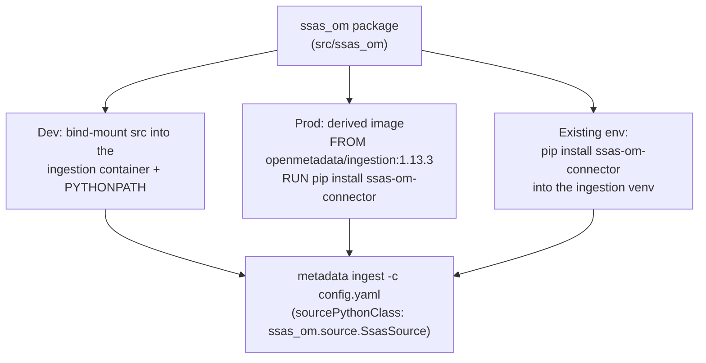

# SSAS → OpenMetadata connector

A read-only [OpenMetadata](https://open-metadata.org) ingestion connector for **SQL
Server Analysis Services**, over XMLA/HTTP (`msmdpump`). It ingests both model kinds as
database services and links them to their relational source for lineage:

- **Tabular** models via `DISCOVER_CSDL_METADATA` ([MS-CSDLBI]) — the model's native shape.
- **Multidimensional** cubes via `MDSCHEMA_*` ([MS-SSAS]) — modelled as a database service
  (dimensions + measures → tables).
- **Lineage** — each SSAS table is linked to its SQL source table (ingested by the built-in
  MSSQL connector).

It authenticates as a **least-privilege reader** and never issues an admin-gated (TMSCHEMA)
request. Built against the Microsoft Open Specifications, not blog posts — see
[`docs/references.md`](docs/references.md).


## How it is installed and distributed

The connector is an ordinary Python package (`ssas-om-connector`, package `ssas_om`) whose
`ssas_om.source.SsasSource` implements the OpenMetadata **custom source** contract. It runs
**inside the OpenMetadata ingestion runtime** and is referenced from the ingestion config by
its class path — OpenMetadata imports and drives it.

Three distribution modes, from dev to prod:



- **Dev (this repo):** `scripts/run-ingestion.sh` bind-mounts `src/` into
  `openmetadata/ingestion:1.13.3` with `PYTHONPATH=/opt/connector` and runs
  `metadata ingest`. Zero build step.
- **Prod:** build a thin image `FROM docker.getcollate.io/openmetadata/ingestion:1.13.3`
  that `pip install`s the wheel, and point your OpenMetadata ingestion pipeline at it.
- **Existing ingestion venv:** `pip install ssas-om-connector` (+ optional extras) alongside
  the OpenMetadata SDK.

The package builds a normal wheel: `python -m build` (hatchling). Optional extras:
`[kerberos]`, `[ntlm]`, `[mssql]`.

## Quickstart (local)

```bash
cp .env.example .env          # fill in host / user / password
docker compose -f docker/compose.yml up -d openmetadata-server   # OM 1.13.3 + deps

# an ingestion-bot / admin JWT for the metadata-rest sink:
export OM_JWT_TOKEN=...        # e.g. admin login token from your OM instance

./scripts/run-ingestion.sh config/ingestion-tabular.yaml.tmpl   # tabular + lineage
./scripts/run-ingestion.sh config/ingestion-md.yaml.tmpl        # multidimensional
# the built-in MSSQL source (lineage target):
./scripts/run-ingestion.sh config/ingestion-mssql.yaml.tmpl
```

The result in OpenMetadata: database services `ssas_tabular`, `ssas_md`, and `hetzner_mssql`,
with the SSAS tables linked to their SQL source.

## Configuration

Credentials come only from a gitignored `.env` (never committed). The ingestion templates
under `config/` are committed with `${VAR}` placeholders; `run-ingestion.sh` substitutes them
into a `0600`, auto-deleted runtime file.

`connectionOptions` understood by the connector:

| option | required | meaning |
|---|---|---|
| `host` | yes | e.g. `http://ssas-host` |
| `endpoint` | yes | `/olap-tab/msmdpump.dll` or `/olap-md/msmdpump.dll` |
| `user`, `password` | yes | reader credentials |
| `catalog` | no | restrict to one catalog; otherwise all are discovered |
| `authMechanism` | no | `basic` (default), `kerberos`, `negotiate`, `ntlm` |
| `lineageService` / `lineageDatabase` / `lineageSchema` | no | link tables to a SQL source (schema default `dbo`) |

### Security models

`basic` (HTTP Basic) is built in and needs no extra dependency. **Kerberos / Negotiate /
NTLM** are supported through `authMechanism`, but they are *not* just a setting — the
ingestion runtime must be prepared for them. The connector runs inside the Linux
OpenMetadata ingestion image, so it authenticates with a **Kerberos keytab/ticket**, not the
logged-in Windows identity (true Windows SSPI works only if the connector runs on Windows).

**Using Kerberos (Windows integrated auth) against `msmdpump`:**

1. **SSAS side** — configure the `/olap-tab` (and `/olap-md`) IIS applications for **Windows
   Authentication** (Negotiate/Kerberos) instead of Basic, and register an SPN for the host,
   e.g. `setspn -S HTTP/ssas-host.domain.com DOMAIN\svc_account`.
2. **Install the extra in the runtime.** In your derived ingestion image:
   ```dockerfile
   FROM docker.getcollate.io/openmetadata/ingestion:1.13.3
   RUN pip install 'ssas-om-connector[kerberos]'   # requests-kerberos + gssapi
   ```
3. **Provide Kerberos config and credentials** to that container: mount `/etc/krb5.conf` for
   your realm plus a **keytab**, and obtain a ticket before the run
   (`kinit -kt /etc/krb5.keytab svc_account@DOMAIN.COM`), or run under a valid `KRB5CCNAME`
   ticket cache. For NTLM instead: `pip install 'ssas-om-connector[ntlm]'` and pass the
   Windows `user`/`password` in `DOMAIN\user` form.
4. **Set the option** in the ingestion config:
   ```yaml
   connectionOptions:
     authMechanism: kerberos      # or: negotiate | ntlm | basic
     host: "https://ssas-host.domain.com"   # HTTPS for integrated auth
     endpoint: "/olap-tab/msmdpump.dll"
     user: "svc_account"          # used by ntlm; ignored by kerberos ticket auth
     password: "..."
   ```

Requesting `kerberos`/`ntlm` without the matching extra installed raises a clear error naming
the missing extra. The connector never logs request bodies or the `Authorization` header.
Basic over plain HTTP sends credentials in clear text — use it only behind a network
firewall, or put HTTPS in front. The MSSQL lineage source is a separate built-in
OpenMetadata connector (`pymssql`) with its own auth settings.

> Status: the `basic` path is validated end-to-end against a live instance. The
> `kerberos`/`negotiate`/`ntlm` selection logic is unit-tested, but end-to-end validation
> needs a Windows-authenticated SSAS endpoint (the reference fixture uses Basic).

See [`ARCHITECTURE.md`](ARCHITECTURE.md#authentication) for the diagram.

## Testing

Unit tests are **offline and hermetic** — sockets are disabled and every response comes from
recorded, scrubbed fixtures under `tests/fixtures/xmla/`. They never touch the live host.

```bash
python -m pytest            # SDK-free modules run; source tests skip without the OM SDK
```

Full coverage (including the `SsasSource` tests) runs where the OpenMetadata SDK is present —
e.g. inside the ingestion image. No fixture, log, or commit ever contains a host, IP,
username, machine name, SID or connection string (enforced by a pre-commit leak-gate).

## Repository layout

```
src/ssas_om/        connector: client, parsers (csdl, mdschema), mappers, source, redaction
config/             committed ingestion templates (no secrets)
docker/             OpenMetadata 1.13.3 compose + a fixture stub server
scripts/            probe.py (discovery) and run-ingestion.sh
tests/              offline unit tests + recorded fixtures
specs/, docs/       spec-kit artefacts, discovery report, normative references
```

See [`ARCHITECTURE.md`](ARCHITECTURE.md) for the design and data flow.
